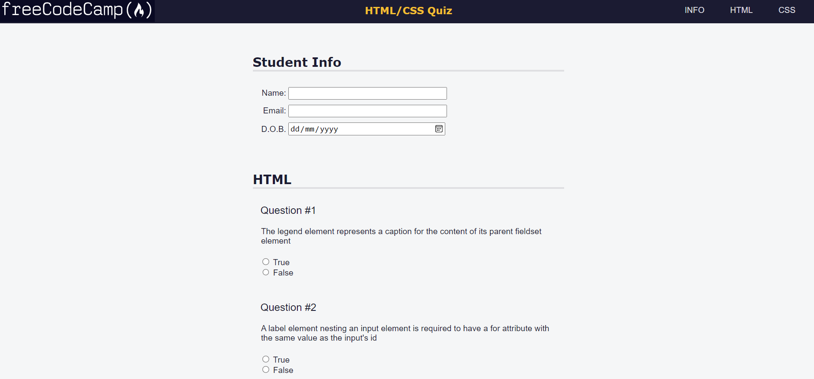

<h2> Building a Quiz </h2>

<h4>Step 7</h4>
Within the header, provide context about the page by nesting one img, h1, and nav element.

The img should point to https://cdn.freecodecamp.org/platform/universal/fcc_primary.svg, and have an id of logo.

The h1 should contain the text HTML/CSS Quiz.
<h4>Step 8</h4>
A useful property of an SVG (scalable vector graphics) is that it contains a path attribute which allows the image to be scaled without affecting the resolution of the resultant image.

Currently, the img is assuming it's default size, which is too large. Correctly, scale the image using it's id as a selector, and setting the width to max(100px, 18vw).
<h4>Step 9</h4>
As described in the freeCodeCamp Style Guide, the logo should retain an aspect ratio of 35 / 4, and have padding around the text.

First, change the background-color to #0a0a23 so you can see the logo. Then, use the aspect-ratio property to set the desired aspect ratio to 35 / 4. Finally, add a padding of 0.4rem all around.
<h4>Step 10</h4>
Make the header take up the full width of its parent container, set it's height to 50px, and set the background-color to #1b1b32. Then, set the display to use Flexbox.
Step 11Passed</h4>
Change the h1 font color to #f1be32, and set the font size to min(5vw, 1.2em).
<h4>Step 12</h4>
To enable navigation on the page, add an unordered list with the following three list items:

INFO
HTML
CSS
The list items text should be wrapped in anchor tags.
<h4>Step 13</h4>
Target unordered list elements within nav elements, and use Flexbox to evenly space the children.
<h4>Step 14</h4>
As this is a quiz, you will need a form for users to submit answers. You can semantically separate the content within the form using section elements.

Within the main element, create a form with three nested section elements. Then, make the form submit to https://freecodecamp.org/practice-project/accessibility-quiz, using the correct method.
<h4>Step 15</h4>
To increase the page accessibility, the role attribute can be used to indicate the purpose behind an element on the page to assistive technologies. The role attribute is a part of the Web Accessibility Initiative (WAI), and accepts preset values.

Give each of the section elements the region role.
<h4>Step 16</h4>
Every region role requires a visible label, which should be referenced by the aria-labelledby attribute.

To the section elements, give the following aria-labelledby attributes:

student-info
html-questions
css-questions
Then, within each section element, nest one h2 element with an id matching the corresponding aria-labelledby attribute. Give each h2 suitable text content.
<h4>Step 17</h4>
Typeface plays an important role in the accessibility of a page. Some fonts are easier to read than others, and this is especially true on low-resolution screens.

Change the font for both the h1 and h2 elements to Verdana, and use another web-safe font in the sans-serif family as a fallback.

Also, add a border-bottom of 4px solid #dfdfe2 to h2 elements to make the sections distinct.
<h4>Step 18</h4>
To be able to navigate within the page, give each anchor element an href corresponding to the id of the h2 elements.
<h4>Step 19</h4>
Filling out the content of the quiz, below #student-info, add three div elements with a class of info.

Then, within each div nest one label element, and one input element.
<h4>Step 20</h4>
It is important to link each input to the corresponding label element. This provides assistive technology users with a visual reference to the input.

This is done by giving the label a for attribute, which contains the id of the input.

This section will take a student's name, email address, and date of birth. Give the label elements appropriate for attributes, as well as text content. Then, link the input elements to the corresponding label elements.
<h4>Step 21</h4>
Keeping in mind best-practices for form inputs, give each input an appropriate type and name attribute. Then, give the first input a placeholder attribute.
<h4>Step 22</h4>
Even though you added a placeholder to the first input element in the previous lesson, this is actually not a best-practice for accessibility; too often, users confuse the placeholder text with an actual input value - they think there is already a value in the input.

Remove the placeholder text from the first input element, relying on the label being the best-practice.
<h4>Step 23</h4>
Arguably, D.O.B. is not descriptive enough. This is especially true for visually impaired users. One way to get around such an issue, without having to add visible text to the label, is to add text only a screen reader can read.

Append a span element with a class of sr-only to the current text content of the third label element.
<h4>Step 24</h4>
Within the span element, add the text (Date of Birth).
<h4>Step 25</h4>
The .sr-only text is still visible. There is a common pattern to visually hide text for only screen readers to read.

This pattern is to set the following CSS properties:

position: absolute;
width: 1px;
height: 1px;
padding: 0;
margin: -1px;
overflow: hidden;
clip: rect(0, 0, 0, 0);
white-space: nowrap;
border: 0;
Use the above to define the sr-only class.

<h4>Step 26</h4>
Within the second section element, add two div elements with a class of question-block.

Then, within each div.question-block element, add one p element with text of incrementing numbers, starting at 1, and one fieldset element with a class of question.
<h4>Step 27</h4>
Each fieldset will contain a true/false question.

Within each fieldset, nest one legend element, and one ul element with two options.
<h4>Step 28</h4>
Give each fieldset an adequate name attribute. Then, give both unordered lists a class of answers-list.

Finally, use the legend to caption the content of the fieldset by placing a true/false question as the text content.
<h4>Step 29</h4>
To provide the functionality of the true/false questions, we need a set of inputs which do not allow both to be selected at the same time.

Within each list element, nest one label element, and within each label element, nest one input element with the appropriate type.
<h4>Step 30</h4>
Although not required for label elements with a nested input, it is still best-practice to explicitly link a label with its corresponding input element.

Link the label elements with their corresponding input elements.
<h4>Step 31</h4>
Give the label elements text such that the input comes before the text. Then, give the input elements a value matching the text.

The text should either be True or False.
<h4>Step 32</h4>
If you click on the radio inputs, you might notice both inputs within the same true/false fieldset can be selected at the same time.

Group the relevant inputs together such that only one input from a pair can be selected at a time.
<h4>Step 33</h4>
To prevent unnecessary repetition, target the before pseudo-element of the p element, and give it a content property of "Question #".
<h4>Step 34</h4>
The final section of this quiz will contain a dropdown, and a text box.

Begin by nesting a div with a class of formrow, and nest four div elements inside of it, alternating their class attributes with question-block and answer.
<h4>Step 35</h4>
Within the div.question-block elements, nest one label element, and give the label elements text content
<h4>Step 36</h4>
Within the first div.answer element, nest one required select element with three option elements.

Give the first option element a value of "", and the text Select an option. Give the second option element a value of yes, and the text Yes. Give the third option element a value of no, and the text No.
<h4>Step 37</h4>
Link the first label element to the select element, and give the select element a name attribute.
<h4>Step 38</h4>
Nest one textarea element within the second div.answer element, and set the number of rows and columns it has.

Then, give the textarea placeholder text describing an example answer.
<h4>Step 39</h4>
As with the other input and label elements, link the textarea to its corresponding label element, and give it a name attribute.
<h4>Step 40</h4>
Do not forget to give your form a submit button.
<h4>Step 41</h4>
Two final semantic HTML elements for this project are the footer and address elements. The footer element is a container for a collection of content that is related to the page, and the address element is a container for contact information for the author of the page.

After the main element, add one footer element, and nest one address element within it.
<h4>Step 42</h4>
Within the address element, add the following:

freeCodeCamp 
San Francisco 
California 
USA
<h4>Step 43</h4>
The address element does not have to contain a physical geographical location. It can be used to provide a link to the subject.

Wrap a link around the text freeCodeCamp, and set its location to https://freecodecamp.org.
<h4>Step 44</h4>
Back to styling the page. Select the list elements within the navigation bar, and give them the following styles:

color: #dfdfe2;
margin: 0 0.2rem;
padding: 0.2rem;
display: block;
<h4>Step 45</h4>
On the topic of visual accessibility, contrast between elements is a key factor. For example, the contrast between the text and the background of a heading should be at least 4.5:1.

Change the font color of all the anchor elements within the list elements to something with a contrast ratio of at least 7:1.
<h4>Step 46</h4>
To make the navigation buttons look more like typical buttons, remove the underline from the anchor tags.

Then, create a new selector targeting the navigation list elements so that when the cursor hovers over them, the background color and text color are switched, and the cursor becomes a pointer.
<h4>Step 47</h4>
Tidy up the header, by using Flexbox to put space between the children, and vertically center them.

Then, fix the header to the top of the viewport.
<h4>Step 48</h4>
When the screen width is small, the h1 does not wrap its text content how it should. Align the text for the h1 element in the center.

Then, give the main padding such that the Student Info section header can be fully seen.
<h4>Step 49</h4>
On small screens, the unordered list in the navigation bar overflows the right side of the screen.

Fix this by using Flexbox to wrap the ul content. Then, set the following CSS properties to correctly align the text:

align-items: center;
padding-inline-start: 0;
margin-block: 0;
height: 100%;
<h4>Step 50</h4>
Set the width of the section elements to 80% of their parent container. Then, use margins to center the section elements, adding 10px to the bottom margin.

Also, ensure the section elements cannot be larger than 600px in width.
<h4>Step 51</h4>
Replace the top margin of the h2 elements with 60px of top padding.
<h4>Step 52</h4>
Add padding to the top and left of the .info elements, and set the other values to 0.
<h4>Step 53</h4>
Give the .formrow elements top margin, and left and right padding. The other padding values should be 0.

Then, increase the font size for all input elements.
<h4>Step 54</h4>
To make the first section look more inline, target only the input elements within .info elements, and set their width to 50%, and left-align their text.
<h4>Step 55</h4>
Target all label elements within .info elements, and set their width to 10%, and make it so they do not take up less than 55px.
<h4>Step 56</h4>
To align the input boxes with each other, set the display property to inline-block for all input and label elements within .info elements.

Also, align the text to the right.
<h4>Step 57</h4>
To neaten the .question-block elements, set the following CSS properties:

text-align: left;
display: block;
width: 100%;
margin-top: 20px;
padding-top: 5px;
<h4>Step 58</h4>
Make the paragraph elements appear as a higher priority, with the following CSS properties:

margin-top: 5px;
padding-left: 15px;
font-size: 20px;
<h4>Step 59</h4>
It is useful to see the default border around the fieldset elements, during development. However, it might not be the style you want.

Remove the border and bottom padding on the .question elements.
<h4>Step 60</h4>
Remove the default styling for the list items of .answers-list, and remove the unordered list padding.
<h4>Step 61</h4>
Give the submit button a freeCodeCamp-style design, with the following CSS properties:

display: block;
margin: 40px auto;
width: 40%;
padding: 15px;
font-size: 23px;
background: #d0d0d5;
border: 3px solid #3b3b4f;
<h4>Step 62</h4>
Set the footer background color to #2a2a40, and use Flexbox to horizontally center the text.
<h4>Step 63</h4>
Now, we cannot read the text. Target the footer and the anchor element within to set the font color to a color of adequate contrast ratio.
<h4>Step 64</h4>
Horizontally center all the text within the address element, and add some padding.
<h4>Step 65</h4>
Clicking on the navigation links should jump the viewport to the relevant section. However, this jumping can be disorienting for some users.

Select all elements, and set the scroll-behavior to smooth.
<h4>Step 66</h4>
Certain types of motion-based animations can cause discomfort for some users. In particular, people with vestibular disorders have sensitivity to certain motion triggers.

The @media at-rule has a media feature called prefers-reduced-motion to set CSS based on the user's preferences. It can take one of the following values:

reduce
no-preference
@media (feature: value) {
  selector {
    styles
  }
}
Wrap the style rule that sets scroll-behavior: smooth within an @media at-rule with the media feature prefers-reduced-motion having no-preference set as the value.

* {
  scroll-behavior: smooth;
}

body {
  background: #f5f6f7;
	color: #1b1b32;
	font-family: Helvetica;
	margin: 0;
}
<h4>Step 67</h4>
Finally, the navigation accessibility can be improved by providing keyboard shortcuts.

The accesskey attribute accepts a space-separated list of access keys. For example:

<button type="submit" accesskey="s">Submit</button>
Give each of the navigation links a single-letter access key.

Note: It is not always advised to use access keys, but they can be useful

Well done. You have completed the Accessibility Quiz practice project.

